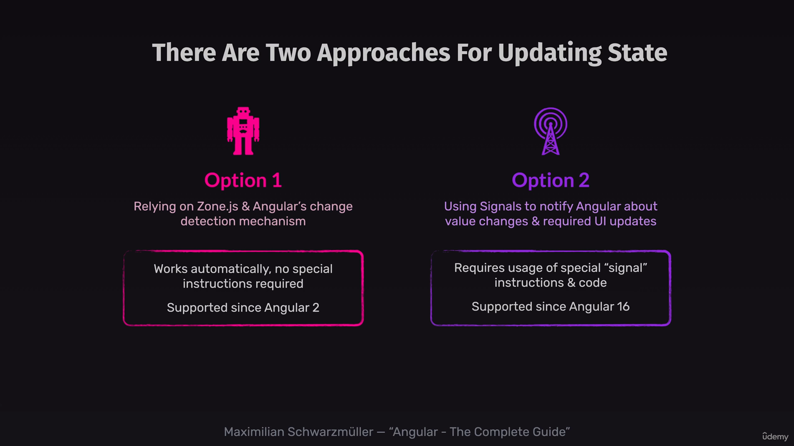
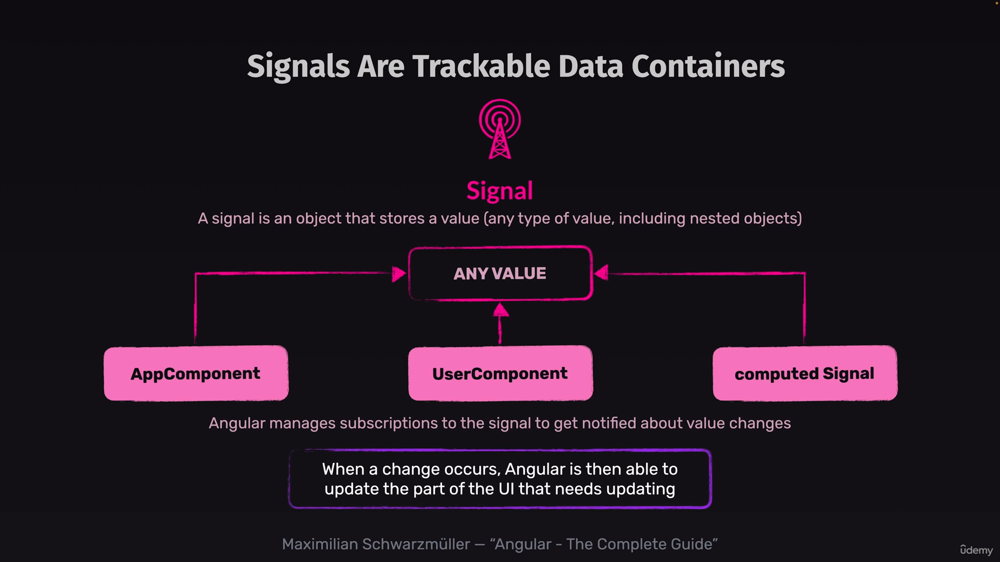

# there are two approaches of updating state


1. Fisrt approach: It relies on zone.js which was there with the advent of angular which detect each possible event or other events like timer Fn when they triggers and update the UI accordingly.

2. Second approach: It relies on data container mechanism which uses flux like state propogation.


## reading signal values in html 

```HTML
<div>
  <button (click)="onSelectUser()">
    
    <p>{{ selectedUser().name }}</p>
  </button>
</div>
```
whenever we use property which is registered in signal data conatiner like the above syntax. 
the ANgular does following things
1. first it identify the place when the value is read.
2. it automatically subscribe the component.
3. It reevaluate whenever the value is changes.
4. this allows angular change detection and UI updation in more efficient manner. 

## computed with signal

```JS
  imagePath = computed(() => 'assets/users/' + this.selectedUser().avatar)
```

### why to read value from signal property with computed function?
with computed Fn angular subscribe the property to signal and it will reevaluate that property only when the property in signal is changed. If we dont use computed Fn angular will reevaluate every time when its loaded.