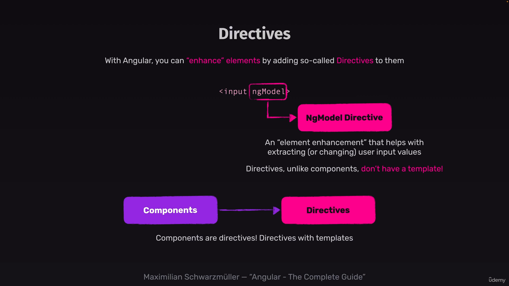

# ngModel



# syntax

```TS
    <p>
      <label for="title">Title</label>
      <input type="text" id="title" name="title" [(ngModel)]="enteredTitle"/>
    </p>

```

```TS
import { FormsModule } from '@angular/forms';
@Component({
  imports: [FormsModule],
})
export class NewTaskComponent {
  enteredTitle = '';

}

```