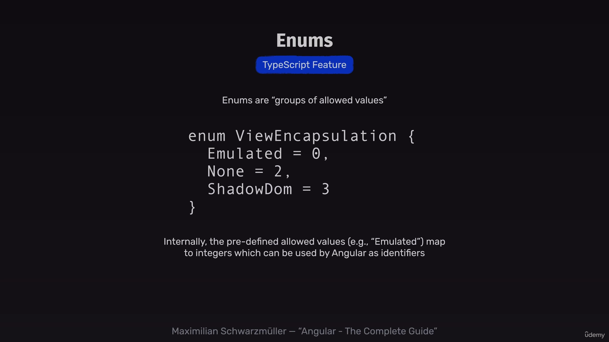
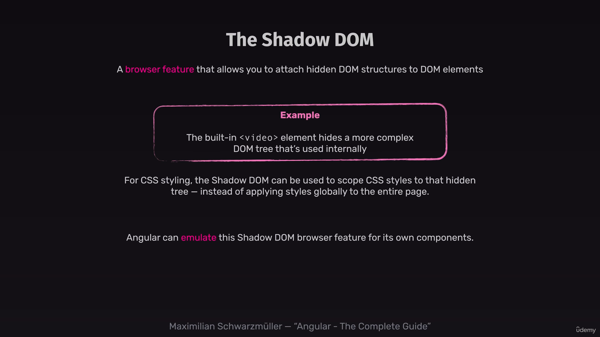

# encapsulation setting
under the hood angular uses shadow dom feature to scope css styling.




this setting can be configured via 

```TS

@Component({
  selector: 'app-control',
  standalone: true,
  imports: [],
  templateUrl: './control.component.html',
  styleUrl: './control.component.css',
  encapsulation: ViewEncapsulation.None
})
```