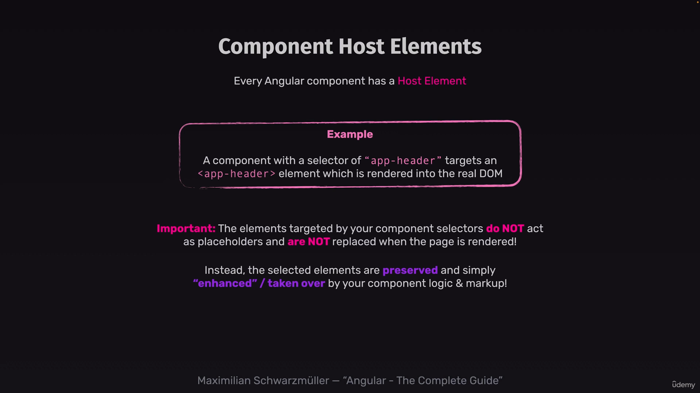

# angular component host element

so when we extended the built in functionality in angular the host elements becomes the built in components. and we can target those elements whith **: host{}** css selector