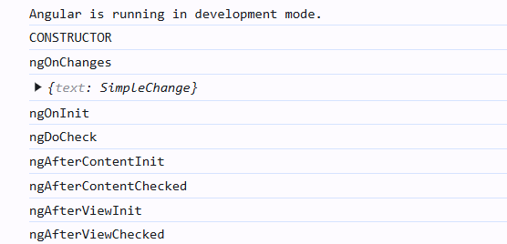
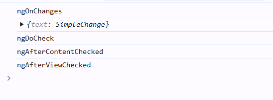

# lifecycles methods

## when component intialises

## when component reexecuted

##  ngOnInit
The ngOnInit method runs after Angular has initialized all the components inputs with their initial values. A component's ngOnInit runs exactly once.

This step happens before the component's own template is initialized. This means that you can update the component's state based on its initial input values.

## ngOnChanges
The ngOnChanges method runs after any component inputs have changed.

This step happens before the component's own template is checked. This means that you can update the component's state based on its initial input values.

During initialization, the first ngOnChanges runs before ngOnInit.

## ngOnDestroy
The ngOnDestroy method runs once just before a component is destroyed. Angular destroys a component when it is no longer shown on the page, such as being hidden by NgIf or upon navigating to another page.

## ngDoCheck
The ngDoCheck method runs before every time Angular checks a component's template for changes.

You can use this lifecycle hook to manually check for state changes outside of Angular's normal change detection, manually updating the component's state.

## ngAfterContentInit
The ngAfterContentInit method runs once after all the children nested inside the component (its content) have been initialized.

## ngAfterContentChecked
The ngAfterContentChecked method runs every time the children nested inside the component (its content) have been checked for changes.

## ngAfterViewInit
The ngAfterViewInit method runs once after all the children in the component's template (its view) have been initialized.

## ngAfterViewChecked
The ngAfterViewChecked method runs every time the children in the component's template (its view) have been checked for changes.