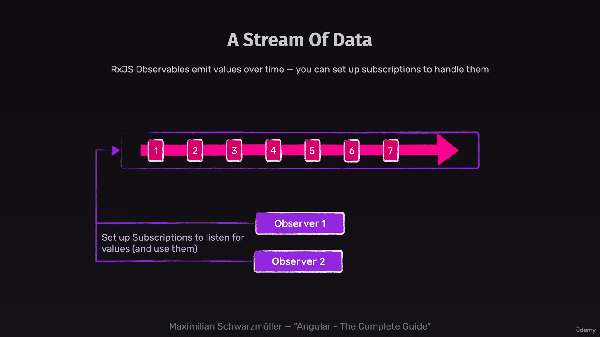

# what is observables
1. It is libarry which is not angular specific and can be used in any nodejs specific project.
2. An observable is an object which produces and control stream of data.



# interval observable
1. Creates an Observable that emits sequential numbers every specified interval of time.
2. Observable only kicks off when there is atleast one sunscripyion is set.
3. observable object: {
    next: whenever a value is received,
    complete: when observable is done its functionality,
    error: whenever an error occurs
    
}


```TS
export class AppComponent implements OnInit {
  private destroyRef = inject(DestroyRef);
  ngOnInit(): void {
    const subscription = interval(1000).subscribe({
      next: (val) => console.log(val),
    });
    this.destroyRef.onDestroy(() => {
      subscription.unsubscribe();
    });
  }
}

```