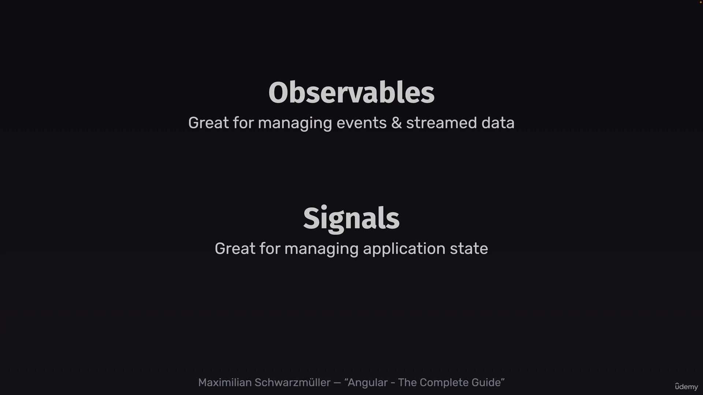

# observables vs subject
Subjects are special kind of observable which emit value manually. we need to set function to manually emit the values. but observables emit values automatically.

# signal
signals works the same way like subjects which emit values.

# signal vs observable
1. signal always kicks off but observables needs to be subscribed first.
2. signal have initial values but observables dont have

