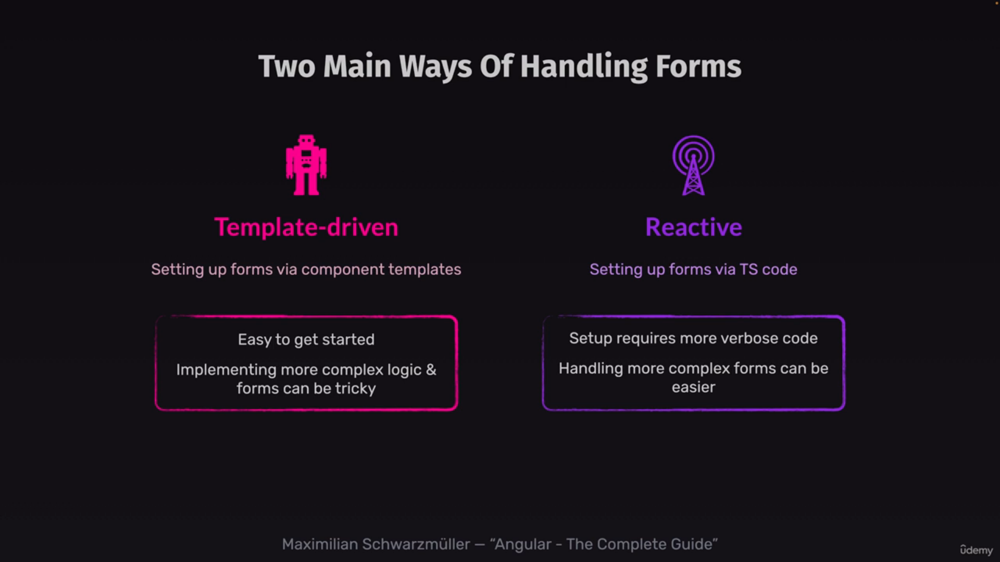

# template driven forms vs reactive forms


# template driven forms
1. more code in template side.
2. input must have name attribute with ngModel to register the form with angular.

```HTML
<form #form="ngForm" (ngSubmit)="submitForm(form)">
  <h2>Login</h2>

  <div class="control-row">
    <div class="control no-margin">
      <label for="email">Email</label>
      <input id="email" type="email" name="email" ngModel/>
    </div>

    <div class="control no-margin">
      <label for="password">Password</label>
      <input id="password" type="password" name="password" ngModel/>
    </div>

    <button class="button">Login</button>
  </div>
</form>
```

```TS
export class LoginComponent {
  submitForm(formData: NgForm) {
    const enteredEmail = formData.form.value.email;
    const enteredPassword = formData.form.value.password;
    console.log(enteredEmail, enteredPassword)
  }
}
```