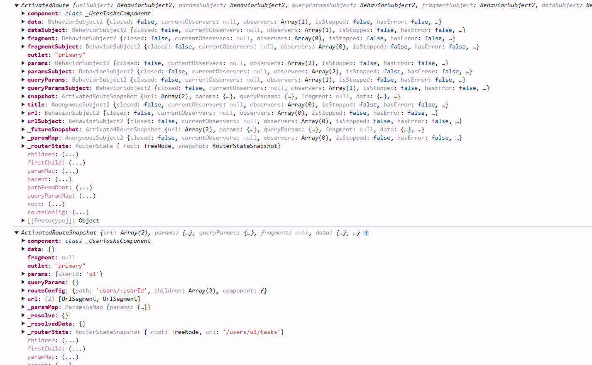

# activateRoute vs activatedRoute snapshot
one major difference is activatedRoute gives a observable properties but snapshot gives only plain properties which means they are not subscribed.

```TS
  ngOnInit(): void {
    console.log(this.activatedRoute);
    console.log(this.activatedRoute.snapshot);
    console.log(this.activatedRoute.snapshot.paramMap.get('userId'));
    const subscription = this.activatedRoute.paramMap.subscribe({
      next: (paramMap) =>
        (this.userName =
          this.userService.users.find((u) => u.id === paramMap.get('userId'))
            ?.name || ''),
    });

    this.destroyRef.onDestroy(() => subscription.unsubscribe);
  }
}

```

